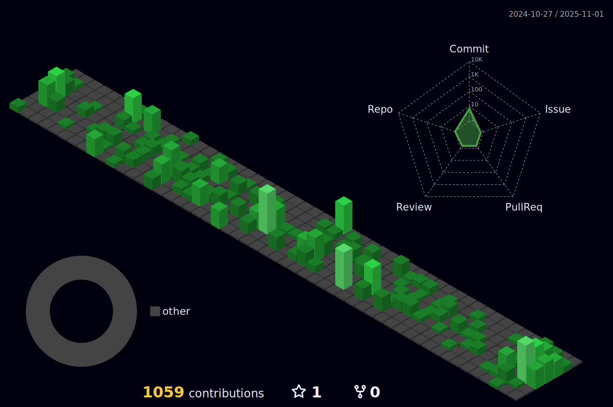

| |  |  
| ----------- |--------------------------------------------------------------------------------------------------------------------------------------------------------------------------------------------|

 

##

 

